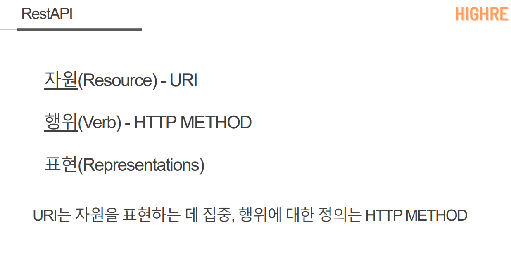

### JAVA/SPRING 
## 안녕하십니까 신입 개발자 김호현입니다.

## 최근 GitHub 활동 📊

---

## **🛠 기술 스택**

 
   
    
    

   
   
   
  
    
   
   

   
   
    
  
   

   
  
  
   

   
   
  
   

   
  
   

 

## **📝 프로젝트**

###  공간대여 앱 프로젝트 (server)  

- **분류:** 미니 팀 프로젝트(4인) 
- **기간:** 2023.04.10 ~ 2023.05.10  
- **사용 기술:** 
  
  
  
  
  
  
  
  
  
  
  
  
   

- **주요 기능:**  
  등록된 공간 목록 조회 
  키워드와 카테고리로 특정한 공간 조회 
  내 주변 지도에서 등록된 공간 조회 
  로그인된 유저로 공간 예약 
  호스트가 승인하면 공간 결제(Bootpay) 
  유저의 예약 및 결제 내역 확인 
  일반 유저의 호스트 신청 
  호스트의 공간 등록 기능 
  예약이나 결제 시 호스트에게 FCM 알림 
  관리자가 호스트 신청, 공간, 유저, 예약, 결제 관리 
- **프로젝트 자세히 보기:** [Village 프로젝트](Village.md) 

 

###  구인구직 프로젝트 (Rest Api) 

- **분류:** 미니 팀 프로젝트(4인) 
- **기간:** 2023.03.20 ~ 2023.03.27(1주)
   
- **사용 기술:** 
   
   
   
  
   
  
   
  
   
  
   
  

 
- **주요 기능:**  
 

  
REST API

  <ul>
   
    <li>MyBatis ORM 구현</li>
    <li>RESTful URI 설계</li>
    <li>JSON 데이터 요청, 응답 구현</li>
   
  </ul>

  
Junit TEST

  <ul>
   
    <li>전체 Controller 테스트 완료</li>
    <li>JWT 테스트 완료</li>
    <li>SALT 암호화 테스트 완료</li>
   
  </ul>

  
JWT

  <ul>
   
    <li>JWT 기반 Stateless 서버 구축</li>
    <li>WhiteURLList 구현</li>
   
  </ul>

  
OAuth

  <ul>
   
    <li>OAuth 카카오 로그인 구현</li>
   
  </ul>

  
AOP

  <ul>
   
    <li>AOP 인증 처리 구현</li>
    <li>AOP 인가 처리 구현</li>
    <li>HandlerMethodArgumentResolver 사용하여 매개변수 값 주입 구현</li>
   
  </ul>

  
Interceptor

  <ul>
   
    <li>요청 응답 후 세션 만료화 구현</li>
   
  </ul>

  
Filter

  <ul>
   
    <li>Filter단에서 JWT 검증 처리</li>
   
  </ul>

 

- **프로젝트 자세히 보기:** [Higher Rest 프로젝트](HigherRest.md) 

 

###  구인구직 프로젝트  

- **분류:** 미니 팀 프로젝트(4인) 
- **기간:** 2023.02.20 ~ 2023.03.10(3주)
   
- **사용 기술:** 
   
   
   
  
   
  
   
  
   
  
   
  

 
- **주요 기능:**  

  
로그인

  <ul>
   
    <li>로그인 기능</li>
    <li>아이디 중복 체크 및 Password 중복 검사</li>
    <li>비밀번호 HASH256, Salt 암호화</li>
    <li>로그인 시 아이디 기억하기 기능(Cookie)</li>
    <li>로그인 시 최초 접속 페이지 유지하기 기능</li>
   
  </ul>

  
회원가입

  <ul>
   
    <li>회원가입 기능</li>
    <li>회원가입 시 기술스택 선택 기능</li>
    <li>회원정보 수정 기능</li>
   
  </ul>

  
이력서

  <ul>
   
    <li>이력서 등록 기능</li>
    <li>이력서 수정 기능</li>
    <li>이력서 삭제 기능</li>
    <li>이력서 선택해서 채용공고 지원하기, 지원 취소하기 기능</li>
   
  </ul>

  
채용공고

  <ul>
   
    <li>채용공고 등록 기능</li>
    <li>채용공고 수정 기능</li>
    <li>채용공고 삭제 기능</li>
    <li>채용공고 제목, 내용으로 검색 기능</li>
    <li>채용공고 카테고리별 검색 기능</li>
    <li>마감일자 기능</li>
    <li>공고 등록시 기술스택 선택 기능</li>
   
  </ul>

  
북마크

  <ul>
   
    <li>북마크하기 기능</li>
    <li>북마크 취소하기 기능</li>
   
  </ul>

  
기업 마이페이지

  <ul>
   
    <li>나의 기업 정보</li>
    <li>지원자 현황 보기(지원자 개인정보와 이력서 열람 기능)</li>
    <li>지원자 합격/불합격 처리하기(마이페이지 동기화 기능)</li>
    <li>나를 북마크한 회원 보기</li>
    <li>기술스택 기준 구직자 매칭서비스</li>
   
  </ul>

  
개인 마이페이지

  <ul>
   
    <li>나의 회원 정보</li>
    <li>나의 지원 현황 보기/지원 취소하기 기능</li>
    <li>내가 북마크한 기업 보기</li>
    <li>기술스택 기준 기업 매칭서비스</li>
   
  </ul>

  
알림 기능

  <ul>
   
    <li>SSE 통신으로 서류 발표 알림 기능</li>
   
  </ul>

  
Redis

  <ul>
   
    <li>Redis 세션 DB 구현</li>
   
  </ul>

 

- **프로젝트 자세히 보기:** [Higher 프로젝트](Higher.md) 

 

🔭 최근 작업 중인 프로젝트: **프로젝트 이름**

📫 연락처: khh5762@naver.com

👩‍💻 GitHub: https://github.com/Khohyeon

📋 노션 링크 :    

