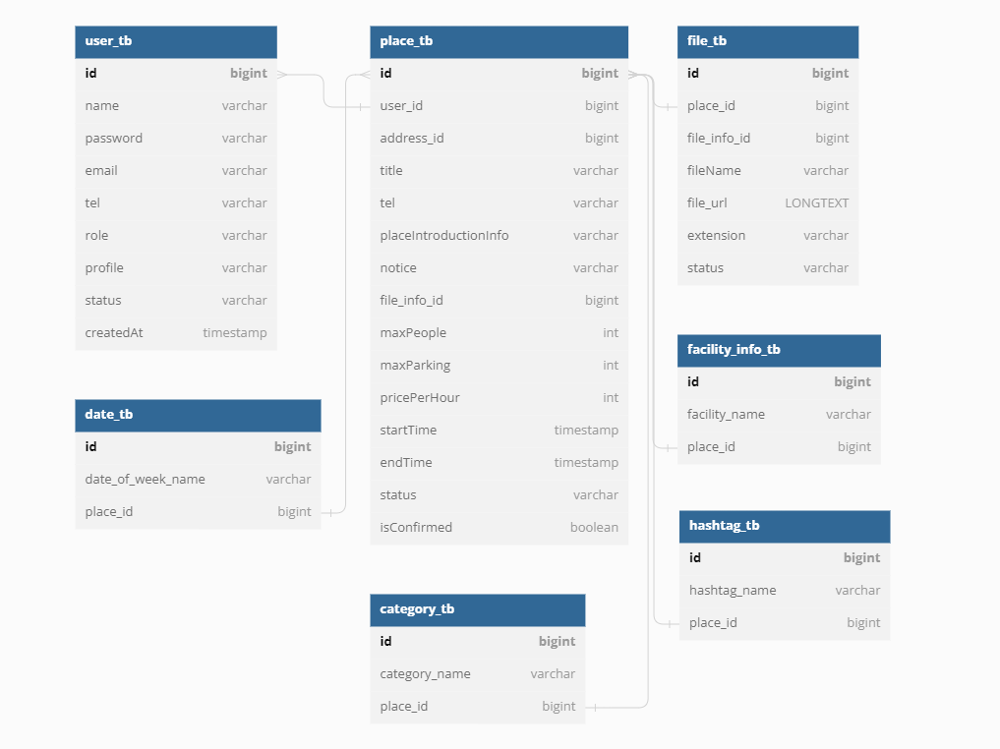

### hey there 
Hi I'm Kim HoHyeon and I'm working in Busan with development.
  

---

<!--START_SECTION:Skills & Endorsements-->
### Skills & Reference

---

### Side Project

1. project
    1. [SpringBoot - project](https://github.com/Khohyeon/Springboot-MyBatis-Recruitment-Project)
    2. [SpringBoot - project - RestAPI](https://github.com/Khohyeon/Springboot-MyBatis-Recruitment-Project-V2-RestAPI)
    3. [SpringBoot - project - Final ](https://github.com/Khohyeon/Village-Back-Project)
2. Codal
    1. [Flutter](https://github.com/JinhuiStudy/flutter-project-codal)

    3. [React](https://github.com/JinhuiStudy/react-project-codal)

# 안녕하세요! [미친개발자]입니다. 👋

저는 [당신의 직업/직위]로서 [회사/기관/프리랜서]에서 일하고 있습니다. 저는 주로 [사용하는 기술/언어]를 사용하여 [관심 분야]에 대한 프로젝트를 진행합니다.

🌱 현재 배우고 있는 것: **새로운 기술/언어**

🔭 최근 작업 중인 프로젝트: **프로젝트 이름**

📫 연락처: [이메일 주소]

🌐 웹사이트: [개인 웹사이트 URL]

👩‍💻 GitHub: [GitHub 계정 URL]

👉 LinkedIn: [LinkedIn 프로필 URL]

## 나의 스킬셋 🚀

### 언어
- [언어1]
- [언어2]
- [언어3]

### 프레임워크 및 라이브러리
- [프레임워크/라이브러리1]
- [프레임워크/라이브러리2]
- [프레임워크/라이브러리3]

### 도구 및 기술
- [도구/기술1]
- [도구/기술2]
- [도구/기술3]

## 최근 GitHub 활동 📊

---

---

### 🔥 최근 GitHub 활동

### JAVA/SPRING 
안녕하십니까 신입 개발자 김호현입니다.
---

---

## **🛠 기술 스택**

 
   
    
    

   
   
   
  
    
   
   

   
   
    
  
   

   
  
  
   

   
   
  
   

   
  
   

 

## **📝 프로젝트**

###  공간대여 앱 프로젝트 (server)  

- **분류:** 미니 팀 프로젝트(4인) 
- **기간:** 2023.04.10 ~ 2023.05.10  
- **사용 기술:** 
  
  
  
  
  
  
  
  
  
   

- **주요 기능:**  
  등록된 공간 목록 조회 
  키워드와 카테고리로 특정한 공간 조회 
  내 주변 지도에서 등록된 공간 조회 
  로그인된 유저로 공간 예약 
  호스트가 승인하면 공간 결제(Bootpay) 
  유저의 예약 및 결제 내역 확인 
  일반 유저의 호스트 신청 
  호스트의 공간 등록 기능 
  예약이나 결제 시 호스트에게 FCM 알림 
  관리자가 호스트 신청, 공간, 유저, 예약, 결제 관리 
- **프로젝트 자세히 보기:** [Village 프로젝트](Village.md) 

 

###  구인구직 프로젝트 (Rest Api) 

- **분류:** 미니 팀 프로젝트(4인) 
- **기간:** 2023.03.20 ~ 2023.03.27(1주)
   
- **사용 기술:** 
  
  
  
  
  
  
  
  
   

   
   
   
  
   
  
   
  
   
  
   
  

 
- **주요 기능:**  
  등록된 공간 목록 조회 
  키워드와 카테고리로 특정한 공간 조회 
  내 주변 지도에서 등록된 공간 조회 
  로그인된 유저로 공간 예약 
  호스트가 승인하면 공간 결제(Bootpay) 
  유저의 예약 및 결제 내역 확인 
  일반 유저의 호스트 신청 
  호스트의 공간 등록 기능 
  예약이나 결제 시 호스트에게 FCM 알림 
  관리자가 호스트 신청, 공간, 유저, 예약, 결제 관리  

- **프로젝트 자세히 보기:** [Readme Rest 프로젝트](HigherRest.md) 

 

###  구인구직 프로젝트  

[//]: # (![village-sample]&#40;https://github.com/clean17/clean17.github.io/assets/118657689/2aef4ac3-8c93-4a97-997a-30290b98f5ce&#41;)

- **분류:** 미니 팀 프로젝트(4인) 
- **기간:** 2023.02.20 ~ 2023.03.10(3주)
   
- **사용 기술:** 
  
  
  
  
  
  
  
  
   

   
   
   
  
   
  
   
  
   
  
   
  

 
- **주요 기능:**  
  등록된 공간 목록 조회 
  키워드와 카테고리로 특정한 공간 조회 
  내 주변 지도에서 등록된 공간 조회 
  로그인된 유저로 공간 예약 
  호스트가 승인하면 공간 결제(Bootpay) 
  유저의 예약 및 결제 내역 확인 
  일반 유저의 호스트 신청 
  호스트의 공간 등록 기능 
  예약이나 결제 시 호스트에게 FCM 알림 
  관리자가 호스트 신청, 공간, 유저, 예약, 결제 관리 

- **프로젝트 자세히 보기:** [Readme 프로젝트](Higher.md) 

 

