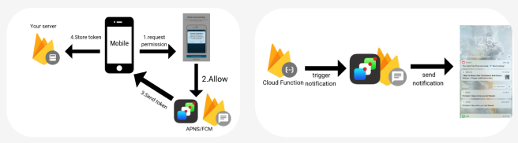

# Village 프로젝트 ( 공간 대여 )

> ## 프로젝트 소개

- 주변에서 춤 연습을 하거나 회의를 하거나 공부를 하려는 등의 공간을 알아보고 있나요 ?  
- 여러분에게 필요한 여러 공간을 여기서 빌려보세요 ! 
- 호스트는 공간을 등록하고 사용자는 예약, 결제를 통해 공간을 빌리는 서비스 입니다.

 

> ## 시연영상 ( Youtube )

https://www.youtube.com/watch?v=X2QB7HTBATU&ab_channel=%EB%A9%94%ED%83%80%EC%BD%94%EB%94%A9

 

> ## 발표자료 ( PDF )

[4조 village.pdf](https://github.com/clean17/Village-Front-Project/files/11440847/4.village.pdf)

 

> ## 프로젝트 기간

- 2023-04-10 ~ 2023.05.10

 

> ## 팀원 소개

### Back-End

|                                                 김호현                                                  |                                                 김정욱                                                  |
| :-----------------------------------------------------------------------------------------------------: | :-----------------------------------------------------------------------------------------------------: | 
|  |  | 
|                                   [@Khohyeon](https://github.com/Khohyeon)                               |                                 [@juk5009](https://github.com/juk5009)                                 |

 

### Front-End
|                                                 박인우(팀장)                                                  |                                                 이인화                                                  |
| :-----------------------------------------------------------------------------------------------------: | :-----------------------------------------------------------------------------------------------------: | 
|  |  | 
|                                   [@clean17](https://github.com/clean17)                                   |                                 [@01LeeInhwa](https://github.com/01LeeInhwa)                                 |

 

> ## 기술 스택

### 개발 툴 

### 사용 언어 

### DB 

  

### 프레임워크 
  

### 사용 기술 

  

 

### 협업 툴 

> ## 내가 한 기능

> ### FCM : Firebase Cloud Messaging - 구글제공 클라우드 메시징 서비스
  
  Firebase의 FCM을 이용하여 예약 및 결제시 HOST의 앱으로 알림기능을 구현  
- FCM을 사용한 이유는 실시간으로 메시지 전송을 지원을 하여 사용자에게 빠르게 알림을 전송할 수 있고 예약과 결제 같이 예민할 수 있는 부분이 있는 기능에는 이런 
실시간 알림이 필요한 어플리케이션에 적합 하다고 생각을 함 
- 앱을 처음 킬 때 firebase에 요청을 하여 토큰을 받고 DB에 저장을 시켜 토큰 값을 보관 
  그 이유는 각 사용자에게 고유한 FCM 토큰을 부여 하고 이 토큰을 DB에 저장하면 개별 사용자를 식별하고 관리 가능   
- 토큰의 유효성 검사를 하기위해 로그인 시 토큰이 맞는지 확인을 함  
- 그 토큰을 firebase의 플랫폼으로 메시지를 전송을 한 후 전송 받은 데이터를 앱에 전달 하고 앱으로 알림을 띄움  
- 예약신청 및 결제신청 할 때 위의 과정을 이용해서 HOST에게 알림을 보내는 기능 구현  
 
> ### AWS S3 - 아마존 웹 서비스의 클라우드 스토리지 서비스 
S3를 이용하여 파일을 AWS 버킷(데이터를 저장하는 기본 단위)에 저장을 하여 파일을 url로 받아 앱으로 전송  
- 파일은 그냥 그대로 DB에 넣어 사용을 할 수 있는데 S3를 사용하는 이유는 ??  
-> DB에 파일을 저장하면 파일 크기나 수에 제한이 있기에 파일 저장 용량과 DB성능에 영향을 줄 수 있기에 많은 양의 파일이나 대용량 파일을 효율적으로 저장하고 관리 할 수 있음
- S3를 사용한 이유는 안정적이고 신뢰할 수 있는 서비스로 인정받고 있다고 하여 사용을 해봤고 사용량에 따라 자동으로 확장되어
데이터의 증가나 변화에 따라 유연하게 대응할 수 있다는 점에서 사용  
- 공간등록, 유저프로필 수정과 같은 이미지 나 파일을 등록 할 때 S3의 버킷에 저장하여 사용

> ### BootPay - 한국의 온라인 결제 서비스 플랫폼
결제 모듈을 간편한 결제 플로우를 지닌 부트페이를 사용했고 결제 검증을 하여 부적절한 요청이 왔을 때 해결  
- 다른 결제 모듈 API 가 존재하지만 BootPay 를 사용한 이유는 다양한 결제 수단으로 사용자들이 편리하게 원하는 결제 수단을 선택하여 결제할 수 있고
개발자 친화적 API 를 제공 및 사용자 인터페이스와 결제 플로우를 쉽게 구현 가능 하여 선택  
- 앱에서 결제를 시도 할 때 받아오는 데이터를 DB에 저장을 하여 실제 결제 완료 정보와 비교를 하여 결제가 성공적으로 이루어 졌는지 여부를 알기 위해 저장  
- 실제 결제가 마무리가 됐을 때 DB에 있던 데이터와 비교를 하여 값이 맞다면 결제를 할 수 있게 사용  
- 만약 결제 시도 후 발생하는 오류 정보를 서버에 전송하여 관리하면 문제가 발생했을 때 신속하게 대응할 수 있도록 사용

> ### Restdocs - Restful API 문서화를 돕는 기술
통합 테스트를 작성하여 Restdocs 를 이용하여 API 문서화를 시켜 봄  
- swagger 와 restdocs 는 똑같이 API 문서화를 시키지만 Restdocs 를 사용한
가장 큰 이유라고 하면 통합테스트를 이용하여 Controller 의 에러를 잡을 수 있고 효율적으로 문서화를 할 수 있었기에 사용   
- swagger 는 주석 기반으로 API 설명을 작성하면 API 코드와 문서가 함께 유지되므로, API 의 동작과 관련된 정보를 쉽게 확인 할 수 있고 백엔드 에서 작업을 할 때 API 코드를 작성하면서
동시에 문서도 작성 할 수 있음  
-> swagger 의 장점을 restdocs 를 사용하면서 극복한 점 : 테스트 케이스를 실행하여 실제 동작하는 API 와 일치하는 정확한 문서를 생성
- Rest API 를 사용하여 통신을 하기 때문에 문서화를 위해 통합 테스트를 구현  
- 테스트 코드에서 사용한 요청과 응답에 대한 문서 템플릿 작성 Asciidoctor 문법을 사용하여 문서를 스타일링 하고 필요한 형식을 출력  
- Rest Docs 사용함으로써 테스트 코드를 실행하여 실제 요청과 응답 결과를 문서에 포함시키기 때문에 이를 통해 정확하고 실제적인 예시를 문서로 제공을 함  

> ## 기능정리
- 등록된 공간 목록 조회
- 키워드로 특정한 공간 조회
- 카테고리 검색 조회
- 내 주변 지도에서 등록된 공간 조회
- 로그인된 유저로 공간 예약
- 호스트가 승인하면 공간 결제(BootPay)
- 일반 유저의 호스트 신청
- 호스트의 공간 등록 기능
- 예약 및 결제 내역 확인
- 예약이나 결제시 호스트에게 FCM 알림
- 관리자가 호스트 신청 관리
- 관리자가 등록된 공간, 유저, 예약, 결제를 모두 관리

 

> ## 테이블 모델링

 

 

> ## 구현 화면

 

> ## 기술 블로그

김호현  
https://oil-hail-ded.notion.site/f503f6f26b7c4a589ee379b27444f078 

김정욱  
https://snapdragon-maple-d1e.notion.site/34fc09fac7684501a4a29bd6da6bb8b5 

박인우  
https://velog.io/@merci/series/Flutter 

이인화  
https://geode-krill-9ab.notion.site/Sliver-0fb83d2a0b7c4a069c73b3a2724a199a 

 

> ## 담당 기능

김호현(백)
- 호스트 신청
- 공간 등록, 조회, 수정
- 예약 신청
- 알림 (FCM)
- 결제 (BootPay)
- 이미지 저장 (S3)
- 관리자 페이지
- RestDoc

김정욱(백)
- 로그인, 회원가입
- 시큐리티, JWT 토큰
- 메인 공간 조회
- 공간 검색(키워드, 카테고리)
- 공간 필터링(정렬)

 

박인우(프론트)

- Riverpod 상태 관리
- 스크립트 EC2, RDS 배포
- 지도, 주소 API 로 지도 보기 및 주소 검색
- Sentry로 에러 관리
- Bootpay로 결제 데이터 관리 및 적용
- 내주변 지도 페이지
- 카테고리, 검색페이지
- 상세 페이지
- 공간 등록 페이지
- 결제 페이지

이인화(프론트)
- Riverpod 상태 관리
- 스플래쉬 페이지
- 메인 페이지
- 로그인, 회원가입 페이지
- 마이페이지
- 호스트 신청 페이지
- 예약내역 페이지
- 공지사항

> ## 보완점

- 리뷰나 스크랩기능은 어렵지 않은데 시간이 부족해 끝내지 못한 점이 아쉽다. 
- 비밀번호 찾기 기능을 하고 싶었지만 못해서 아쉽다. 
- rebase 머지를 처음 하면서 여러 어려움을 겪었지만 다음에는 경험을 바탕으로 잘 처리할 것이다. 

 

> ## 후기

김호현
- 프론트 와 백엔드로 나누어 프로젝트를 처음 해봤기에 소통을 하는 부분이 부족하다는 것을 느꼈습니다.
- JPA 를 처음 사용하면서 처음에는 복잡하고 힘들다고 생각을 했지만 잘 이해를 하면 오히려 편하게 사용 할 수 있다고 생각이 들었고 무엇보다도 Restdocs 를 사용 하기 위해 Test 코드를 작성을 하며 좋은 결과를 이루었다.
- FCM , AWS S3, BootPay, Restdocs 와 같은 여러 API 문서를 보면서 많이 공부를 하는 시간을 가진 것 같고 한편으로 많이 성장 하는 시간이었다고 생각합니다. 

박인우
- 프로젝트를 진행하면서 초기 계획과 많이 달라져 힘든 부분도 있었지만 조금 더 개발이라는 업무와 가까워진것 같다.
- 팀원들을 이끌면서 팀장이라는 역할에 대해 다시 한번 생각하는 계기가 되었다.

이인화
- 파이널 프로젝트를 하며 다양한 기능을 구현해 볼 수 있어서 재밌었습니다
- 리버팟에 익숙하지 않아 데이터를 바인딩하는데 어려움을 겪어 아쉬웠지만 팀원들과 함께 프로젝트를 만들어 좋은 경험이었습니다.

김정욱
- 배려심과 책임감이 강한 팀원들과 작업해서 저는 너무 행복하게 작업했습니다.
- 6개월동안 저도 그렇고 모두들 쉴틈없이 작업했는데 다들 원하는 곳에 취업하고 좋은 결과 얻었으면 좋겠습니다

